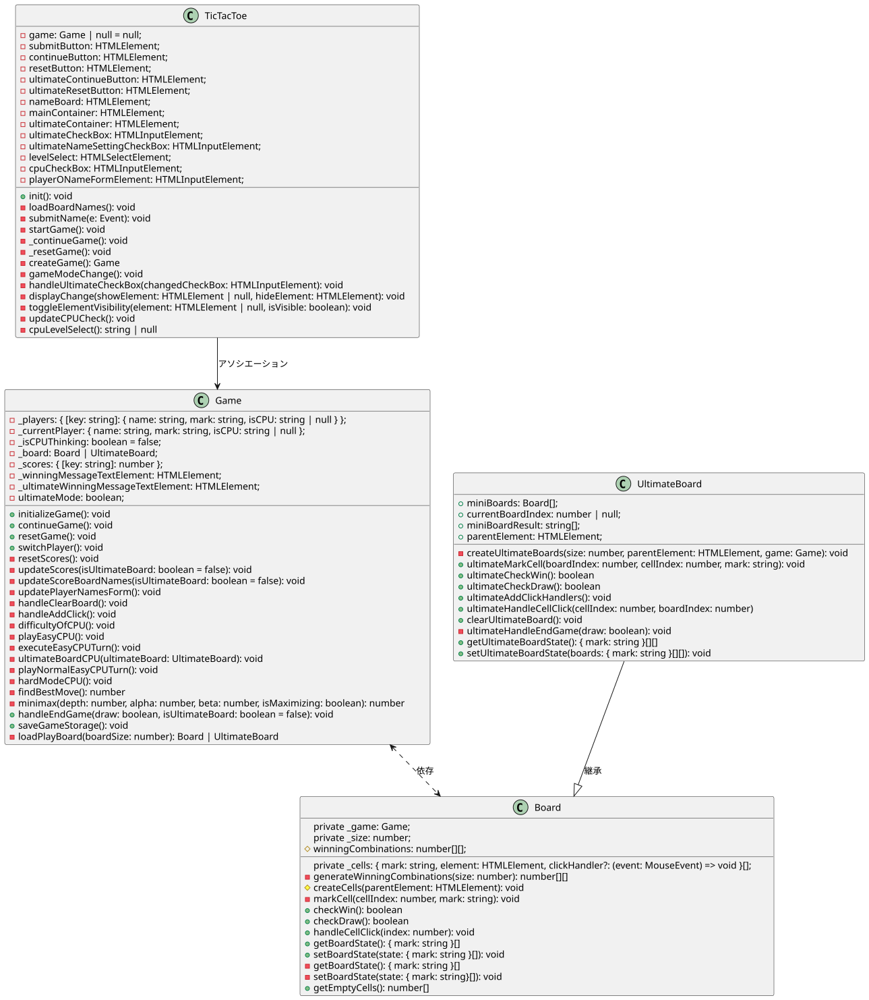
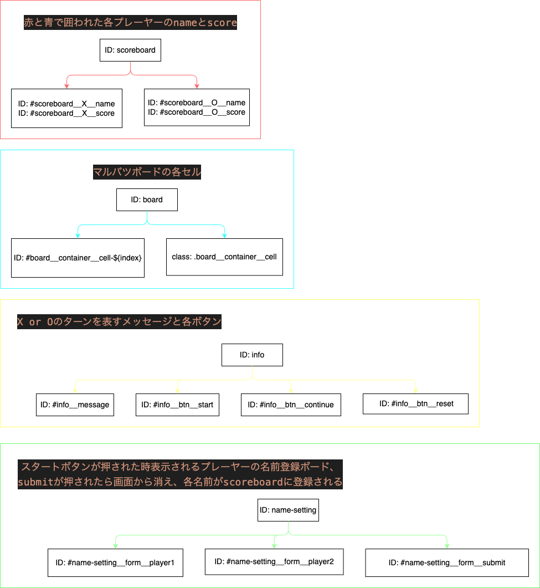

# Tic-Tac-Tao
## URL
https://test-team-b.github.io/work-space/

## デモ
### ノーマルモード

### ノーマルモードCPU対戦

### アルティメットモード

### アルティメットモードCPU対戦

## 機能
- ユーザー対戦機能
- CPU対戦機能
- 3×3(ノーマル)モード
- 9×9(アルティメット)モード
- ローカルストレージ保存

## UI・デザインについて
### 全体像
HTML・CSS・Bootstrapをベースにモダンな雰囲気に装飾しました。一見シンプルな見た目なのが特徴ですが、ボーダースタイルのridgeとbox-shadowをボーダーの内側と外側にさりげなく入れることで、まるでゲームの盤面が目の前にあるような立体感を作り上げました。また、各画面幅に対応したレスポンシブデザインを採用し、モバイルやipadでプレイできます。現在はChromeとBraveブラウザに対応したデザインとUIになっています。
### Background-color
ゲーム画面、Options、Name-Settingsのそれぞれのバックグラウンドにlinear-gradientというグラデーションを効果を適用することで、モダンながらも背景を少し遊ばせ、無機質さを軽減させたデザインに仕上げました。
### Navbar
UIの一貫としてNavbarを画面上部に設置しました。これによりどの画面幅でもシームレスにサイドメニューへアクセスが可能になり、ユーザフレンドリーなUI・デザインを設計しています。
### Game Board
ノーマルモードのゲームボードは丸型のセルデザインを採用することで可愛らしさと、気楽性を重視しているのに対し、アルティメットモードのゲームボードは和風でより頭脳戦を必要とするハイレベルなゲームが楽しめるようなデザインを意図して作成しております。また、アルティメットボードには現在と次のターンのプレーヤーのボードをナビゲートする機能を備えることで、ルールを知らない方でもすぐに始められるUX設計も本プロジェクトのこだわり抜いたポイントの一つです。

## ゲームルール
### ノーマルモード

プレイヤーは、3x3のグリッド（盤面）上に自分の記号（通常は「〇」（まる）または「×」（ばつ））を交互に置いていき、先に縦、横、または斜めの一列に同じ記号を3つ並べたプレイヤーが勝者となります。全てのマスが埋まっても、どちらのプレイヤーも勝利条件を満たさない場合は引き分けになります。

### アルティメットモード

3x3のグリッドの各マスにさらに3x3のグリッドが含まれている、合計で9つの小さなボードから成る大きなボードでプレイします。
1. ゲームの開始:\
先攻のプレイヤーが、大きなボードの任意の小さなボードの任意の空きマスに自分の記号を置きます。

2. ゲームの進行:\
プレイヤーは交互に記号を置いていきますが、プレイヤーが記号を置いた小さなボードのマスの位置に基づいて、次のプレイヤーが置くボードが決まります。例えば、プレイヤーが中央の小さなボードの右下のマスに記号を置いた場合、次のプレイヤーは大きなボードの右下の小さなボードでプレイを続けなければなりません。

3. 小さなボードの勝利:\
各小さなボードは独立したまるバツゲームとして機能し、そのボード内で先に縦、横、または斜めの一列に同じ記号を3つ並べたプレイヤーがそのボードを制覇します。

4. 大きなボードの勝利:\
小さなボードを制覇すると、そのボード全体がそのプレイヤーの記号で占められたと見なされます。大きなボード上でも同様に、縦、横、または斜めに3つの小さなボードを制覇したプレイヤーがゲームの勝者となります。

5. 引き分けと戦略の調整:\
小さなボードで引き分けが発生する場合、そのボードはどちらのプレイヤーも制覇できなくなります。また、プレイヤーが送られた小さなボードがすでに決着がついている（勝者がいる、または引き分け）場合は、そのプレイヤーは大きなボード上で任意の小さなボードに記号を置くことができます。

## localStorage
スコアボードやセルの状態がlocalStorageに保存されます。勝利判定をした時やコンテニューボタン、リセットボタンを押した時に自動でlocalStorageに保存されます。ノーマルモードとアルティメットモードは別々のlocalStorageに保存されますが、リロード時の名前入力フォームの復元はノーマルモードの名前を復元するようにしています。アルティメットモードのチェックボックスのチェックの有無に従い、スタートボタンを押された時に復元するデータを選択し復元します。

## CPU機能について
ミニボード用のCPU,アルティメットモード用のCPUがあります。それぞれ、難易度が選ぶことができ、EASY, HARDがあります。ミニボード用はHARDモードがプレイ可能ですが、アリティメット用のHARDモードは未実装です。

## 使用方法
### 初期画面(NameSetting)
#### 1. アルティメットモードの選択
チェックボックスにチェックを入れてからスタートボタンを押すことで、ノーマルモードからアルティメットボードへの切り替えができます。
#### 2. CPUモードの選択
チェックボックスにチェックを入れてからスタートボタンを押すことで、CPUモードへの切り替えができます。デフォルトで **NON CPU** になっているため、オプション画面でCPUの難易度を選択してください。
#### 3. プレイヤーネームの入力
名前入力フォームに名前を入力してください。ゲーム画面で名前が反映されます。プレイヤー1が **X** 、プレイヤー2が **O** となっています。なお、CPUモードを選択している場合はプレイヤー2の名前フォームに **CPU** と自動で反映されます。
#### 4. スタートボタン
初期画面での入力はスタートボタンをクリックすることで反映されます。
CPUモードのチェックボックスにチェックが入った状態でスタートボタンを押すと、オプション画面が開きCPUの難易度選択ができます。PUモードのチェックボックスにチェックが入っていない場合は、初期画面が非表示になりゲームがスタートします。そのほかのオプション画面の機能設定の詳細は、以下で説明しています。
___
### オプション画面(Options)
#### 1. クリック音のミュート選択
クリック音がデフォルトで再生されるようになっているため、チェックボックスにチェックを入れることでミュートにできます。
#### 2. バックグラウンドサウンドの再生・音量調節
バックグラウンドサウンドはデフォルトでミュートになっているため、再生ボタンを押すと再生されます。ループして再生されます。
#### 3. CPUの難易度
CPU難易度はデフォルトで **NON CPU** になっています。このドロップダウンメニューから、'EASY', ''MEDIUM', 'HARD' の中から難易度を選択できます。各CPU難易度の実装内容については [CPU機能について](#cpu機能について) を参照してください。
___

### ゲーム画面
- ナビゲーションバー
  1. TicTacToe\
クリックするとホームに戻ります。

  2. NameSetting\
クリックすると名前入力フォームが表示されます。スタートボタンを押すとオプション画面が表示されます。クローズボタンを押すと画面が非表示になります。スタートボタンを押さずにクローズボタンを押すと設定は反映されません。

  3. Options\
クリックするとオプション画面が表示されます。クローズボタンを押すと画面が非表示になります。ここでの設定は選択した時点で反映されます。クローズボタンを押しても設定が反映されます。

- ボード\
ゲームをプレイするボードです。デフォルトで3×3のボードが表示されます。アルティメットボードを選択した場合、3×3のボード(ミニボード)が3×3で並んで表示されます。なお、初期画面(NameSetting)でスタートボタンを押さなければ、ボードの中のセルは表示されません。スタートボタンを押すことでセルが生成されるようになっています。ルールに従ってセルをクリックすると、クリック音が鳴り現在のプレイヤーに応じたマークがセルに表示されます。
- スコアボード\
初期画面(NameSetting)で入力したプレイヤー名がここに表示されます。名前の右側にプレイヤーのマークが表示され、左側に勝利数がカウントされ他ものが表示されます。
- ボタン
  - Continueボタン\
ボタンをクリックすることで、スコアボード表示はそのままでボードのセルのマークがクリアされます。
  - Resetボタン\
ボタンをクリックすることで、スコアボード表示やスコアボード、localStorageの履歴が削除されます。ノーマルボードとアルティメットボードの履歴は別々で管理されているため、一方を削除しても一方は残っている状態になります。
- ターン表示\
ターンが変わるごとに現在のターンのプレイヤーを表示します。
___

## 使用技術
| カテゴリ       | 技術スタック|
|--------------|----------------------------------------------------|
| フロントエンド   | HTML, CSS, TypeScript, JavaScript, localStorage|
| フレームワーク  | BootStrap|
| インフラ       |Ubuntu|
| その他        | Git, Github|
| 開発環境       | Visual Studio Code                                 |
| プロジェクト管理ツール | Trello|
| コミュニケーションツール | Discord, oVice|

## UML図

## HTML-CSS関連図

## 作成の経緯
[Recursion](https://recursionist.io/) というコンピュータサイエンスの学習プラットフォームサービスで、チーム開発を行いました。Gitの使い方を学ぶことを目的とした開発であったため、簡単なゲームを作成しながらGitやGitHubの使い方を学びました。Gitの使い方に慣れてきたところで追加機能をつけるという方向になり、ミーティングを重ねながら機能を実装していきました。

## こだわった点
### DRYの原則
ソフトウェア設計の基本として重複したコードを押さえることを意識しました。同じロジックやデータを複数の場所にコピー＆ペーストするのではなく、関数、メソッド、クラス、またはモジュールなどを利用して共通のコードを一か所にまとめ、それを必要な場所から呼び出すようにしました。

### 拡張性
アルティメットモードまで実装することを目標にしていたため、セルやボードの数、勝利条件などを静的に定義してしまうと同じことを何度も書くことになり、DRYの原則に反すると考えたため動的に実装していきました。セルやボードをHTMLで記述せずにスタートボタンが押されたタイミングで生成されるようにTypeScriptで記述しました。また勝利条件についても今後セルの数が３×３以外に拡張する可能性も考え、セルの数に合わせて計算できるように実装しています。

### TypeScript
初心者のチーム開発だったため、TypeScriptの静的型システムは開発プロセスの初期段階でエラーを捕捉するのに助けとなると考えTypeScriptで開発を行いました。また、TypeScriptの明示的な型宣言はリファクタリングを安全に行うことができるため、今後は学習を進めインターフェイスを実装していきたいと考えています。

### チーム開発
毎日午前中に15分から３０分程度のミーティングを行い、進捗の報告とバグの共有、疑問点の解決などを行いました。また、各自得意分野を教え合うことにより知識の補強ができました。コミュニケーション管理については、DiscordやoVice、Trelloなどのツールを使い、ミーティング以外でも相談し合える環境で開発に取り組みました。

### UML図
開発を進めるにあたり全体像の把握や、HTMLのクラス・idの共有を行うためにUML図の作成を行いました。Visual Studio Codeと互換性のあるplantUMLやdraw.ioを使用しGit上で共有を行いました。

### ブランチ設計
Git、GitHubの使い方を学ぶことが今回のチーム開発の主な目的だったため、シンプルで直感的なブランチ設計であるGit Hub Flowを採用しました。小さな変更を頻繁にマージすることで、バグや問題を早期に発見し、修正していきました。

## 参考文献
- 参考ドキュメント
  - [Web API](https://developer.mozilla.org/ja/docs/Web/API)
- 参考サイト
  - [Recursion_TypeScript入門](https://recursionist.io/learn/languages/typescript/)
  - [サバイバルTypeScript](https://typescriptbook.jp/)

